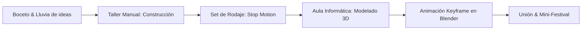
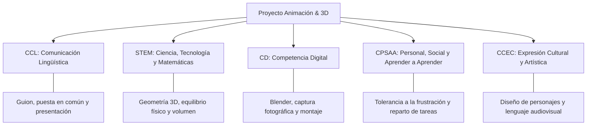

# 🎬 Guía Didáctica: Animación Artesanal y 3D
## *Stop Motion + Blender*
> **Proyecto educativo para alumnado de 10 a 14 años en centros con recursos limitados**  
> **Duración:** 34 sesiones lectivas de 50 minutos  
> **Modalidad de trabajo:** Stop Motion en grupos cooperativos + Blender individual + Proyecto final híbrido

---

### 💡 Idea Central del Proyecto
```
   [ 📦 Material Reciclado ] ──► [ 📸 Stop Motion Físico ]
                                           │
                                           ▼
   [ 🎞️ Corto Híbrido Final ] ◄── [ 💻 Reinterpretación 3D en Blender ]
```
> El alumnado diseña y construye un personaje con materiales reciclados de bajo coste, lo anima fotograma a fotograma en stop motion, lo traslada e interpreta como un modelo 3D estilizado en Blender y, finalmente, crea un microcorto híbrido que conecta el mundo tangible con el universo digital.

---

## 📑 Índice de Contenidos
1. [Planteamiento general del proyecto](#1-planteamiento-general-del-proyecto)
2. [Metodología y organización del aula](#2-metodología-y-organización-del-aula)
3. [Materiales generales y requisitos técnicos](#3-materiales-generales-y-requisitos-técnicos)
4. [🛠️ Guía Práctica de Construcción de Puppets (Paso a Paso para Alumnado)](#4-guía-práctica-de-construcción-de-puppets-paso-a-paso-para-alumnado)
5. [Terminología clave explicada](#5-terminología-clave-explicada)
6. [Programación completa de sesiones (1 a 34)](#6-programación-completa-de-sesiones)
7. [Evaluación, inclusión y seguridad](#7-evaluación-inclusión-y-seguridad)
8. [Anexo: Programación curricular LOMLOE para centros](#8-anexo-programación-para-centros-educativos)
9. [Referencias y recursos](#9-referencias-consultadas)

---

## 1. Planteamiento General del Proyecto

Esta guía articula una experiencia didáctica para estudiantes de **10 a 14 años** (5.º/6.º de Primaria y 1.º/2.º de ESO) combinando la calidez del trabajo manual con la alfabetización digital en 3D. 

Está específicamente optimizada para **aulas con equipamiento estándar o limitado**, descartando aditamentos costosos (*armatures* articuladas de metal, fijaciones mecánicas *tie-downs* o *rigs* de suspensión).

### 🎯 Objetivos de Aprendizaje
* **Comprender la ilusión del movimiento** mediante la manipulación directa fotograma a fotograma.
* **Resolver problemas estructurales** (centro de gravedad, estabilidad y peso) con materiales de reciclaje.
* **Aprender Blender sin frustración**, trabajando de forma individual mediante figuras geométricas elementales (*primitivas*).
* **Fomentar el trabajo en equipo y la coeducación**, repartiendo responsabilidades équitativas en el set de rodaje.

### 📊 Estructura de Bloques y Temporalización

| Bloque | Eje Temático | Dinámica | Sesiones (50') | Producto Entregable |
| :--- | :--- | :---: | :---: | :--- |
| **Bloque 1** | Stop Motion artesanal con marionetas recicladas | Grupos de 3-4 | **11** | Microcorto físico (10-15 s) |
| **Bloque 2** | Iniciación a Blender: formas, materiales, luces y *keyframes* | Individual | **14** | Clip de personaje 3D animado (5-10 s) |
| **Bloque 3** | Proyecto final híbrido (Físico + Digital) | Mixto | **9** | Cortometraje mixto con transición narrativa |
| **TOTAL** | **Curso Completo** | **Combinada** | **34** | **Mini-festival y exposición final** |

> [!IMPORTANT]
> **Criterio metodológico clave:**  
> * **Stop Motion en grupos:** Requiere sincronía de roles (manipulador, fotógrafo/a, claqueta/continuidad e iluminación).  
> * **Blender individual:** La motricidad fina digital y la orientación tridimensional se asimilan operando directamente el ratón y la interfaz. Cada estudiante debe tener su propio archivo `.blend`.

---

## 2. Metodología y Organización del Aula



### 🤝 Roles en el Equipo de Rodaje (Rotativos)
Para garantizar la implicación de todo el alumnado durante el Bloque 1 y 3:
1. **Dirección y Continuidad:** Comprueba que la acción siga el *storyboard*, que la iluminación no varíe y que no entren sombras ajenas en encuadre.
2. **Animación (Manipulador/a):** Efectúa microdesplazamientos del puppet entre toma y toma.
3. **Cámara y Disparo:** Mantiene firme el dispositivo, vigila el visor y pulsa el disparador sin mover el soporte.
4. **Arte y Efectos (Foley):** Diseña elementos del escenario y graba sonidos de apoyo (crujidos, palmadas, chasquidos).

---

## 3. Materiales Generales y Requisitos Técnicos

### 📦 Taller de Stop Motion (Coste Cero / Reciclaje)
* **Cuerpo y estructuras:** Cajas de medicamentos o zapatos, envases de yogur, rollos de cartón, hueveras, papel de periódico.
* **Masa y anclaje:** Plastilina escolar (sirve de peso y unión), papel de aluminio (núcleo ligero para ahorrar plastilina).
* **Uniones y corte:** Cinta de carrocero (fácil de retirar), pegamento de barra, cola blanca, tijeras de punta redonda.
* **Captura:** Dispositivos móviles, tabletas o webcams con apps gratuitas (p. ej., *Stop Motion Studio* con función *onion skin*).
* **Fijación de cámara:** Trípodes escolares o torres improvisadas de libros/cajas firmemente encintadas.
* **Iluminación:** Flexos de estudio o luz fija de aula (cerrar persianas para evitar variaciones de luz solar).

### 🖥️ Taller de Blender (Aula de Informática)
* **Software:** Blender (versión LTS 3.3, 3.6 o 4.x), gratuito y de código abierto.
* **Periféricos indispensables:** **Ratón con rueda central (scroll/botón central).** El manejo 3D mediante *touchpad* genera frustración y ralentiza la clase.
* **Optimización en equipos modestos:** Trabajar en modo *Solid* o *Material Preview*; resolución de salida a 720p (1280x720) o utilizar *Viewport Render Animation* para exportar al instante sin sobrecargar la CPU.

---

## 4. 🛠️ Guía Práctica de Construcción de Puppets
*(Manual paso a paso diseñado con lenguaje directo para el alumnado)*

> [!CAUTION]
> **Regla de Oro de la Animación Artesanal:**  
> **«La Prueba de los 10 Segundos»**: Antes de empezar a rodar, tu personaje debe ser capaz de quedarse completamente inmóvil sobre la mesa durante 10 segundos seguidos sin tambalearse ni caerse. Si se cae, necesita base más ancha o más contrapeso de plastilina en la parte inferior.

```
                  ┌──────────────────────────────┐
                  │ ¿Qué modelo vas a construir? │
                  └──────────────┬───────────────┘
                                 │
         ┌───────────────────────┼───────────────────────┐
         ▼                       ▼                       ▼
   [ Modelo 1 ]            [ Modelo 2 ]            [ Modelo 3 ]
   CRIATURA DE LA CAJA     MONSTRUO BLOB           PLANTA CARNÍVORA
   (Nivel: Muy fácil)      (Nivel: Muy fácil)      (Nivel: Medio)
   Base: Caja rígida       Base: Masa aplastada    Base: Vaso/Maceta
```

---

### 📦 Modelo 1: La Criatura de la Caja (*Nivel: Muy Fácil*)
*Un ser tímido o travieso que vive camuflado dentro de un envase. ¡La propia caja es su cuerpo y soporte, así que jamás se caerá!*

```
     [ Tapa articulada ] ──► ┌─────┐  ◄── [ Ojos saltones ]
                             │ ^ ^ │
     [ Peso interior ]   ──► │ === │  ◄── [ Boca / Dientes ]
                             └─────┘
```

#### Materiales que necesitas
* 1 caja pequeña de cartón (pastillas, infusión o perfume pequeño).
* Cinta de carrocero o cinta adhesiva transparente.
* Plastilina de 2 o 3 colores.
* Cartulinas, tijeras, pegamento y rotuladores.
* 2 tapones pequeños de botella (opcional, para los ojos).

#### 👣 Paso a Paso para Alumnos
1. **Prepara el contrapeso:** Abre la caja y pega en el fondo interior una bola aplastada de plastilina o una piedra pequeña. Esto bajará su centro de gravedad y evitará que vuelque al moverla.
2. **Crea la apertura móvil:** Corta una ranura frontal o deja la tapa superior suelta, reforzando la unión trasera con una tira de cinta adhesiva a modo de bisagra.
3. **Modela los ojos:** Haz dos bolas de plastilina blanca y añade dos bolitas negras para las pupilas (o utiliza dos tapones de plástico). Pégalos en el borde interior de la tapa.
4. **Diseña la boca y sorpresa:** Recorta dientes triangulares en cartulina blanca y una lengua roja o tentáculo flexible de plastilina. Pégalos dentro de la caja.
5. **Personaliza el exterior:** Pinta manchas, escamas o pelo con rotuladores en las caras externas de la caja.
6. **Comprobación:** Abre y cierra la tapa 5 veces. Si el puppet no se mueve del sitio al soltarlo, ¡está listo para rodar!

---

### 🟢 Modelo 2: Monstruo Blob de Plastilina (*Nivel: Muy Fácil*)
*Una criatura gelatinosa de forma orgánica que no camina con piernas: repta, se estira, se aplasta y rueda como una gota viviente.*

```
               [ Ojos saltones ]
                     (o)(o)
                 .---''''---.
                /            \  ◄── Cobertura exterior de plastilina
               |   [ALUMINIO] | ◄── Núcleo interno ligero
                \____________/
               [ Base ensanchada ]
```

#### Materiales que necesitas
* Plastilina de colores (1 o 2 pastillas).
* Papel de aluminio (1 o 2 hojas arrugadas).
* Cartón pequeño como peana o escenario.
* Palillos de madera o pajitas recortadas (para pinchos o antenas).

#### 👣 Paso a Paso para Alumnos
1. **Fabrica el núcleo ligero:** Arruga una hoja de papel de aluminio hasta formar una pelota ovalada compacta del tamaño de una nuez o huevo. *(Esto ahorra plastilina y evita que el muñeco sea demasiado pesado).*
2. **Cubre con la piel de plastilina:** Aplasta plastilina entre tus manos como si hicieras una masa de pizza y forra la pelota de aluminio por completo hasta que no se vea el brillo plateado.
3. **Ensancha la base:** Apoya la criatura sobre la mesa y presiona suavemente hacia abajo para crear una base ancha y plana. Debe parecer una lágrima o un flan.
4. **Añade rasgos expresivos:** Fabrica ojos saltones con palillos clavados en el cuerpo o bolitas aplicadas directamente. Marca una hendidura para la boca con la uña o un lápiz.
5. **Crea piezas de recambio (Técnica de Sustitución):** Modela aparte 3 bocas de diferente tamaño (cerrada, media sonrisa y sorpresa abierta). Durante la animación solo tendrás que cambiar una por otra.
6. **Comprobación:** Da un suave golpe a la mesa. El monstruo no debe volcarse ni deformarse sin que tú lo toques.

---

### 🪴 Modelo 3: Planta Carnívora en Maceta (*Nivel: Medio*)
*Una planta con apetito insaciable que gira, asoma la cabeza y muerde. La maceta reciclada actúa como trípode natural.*

```
                 ( > O < )   ◄── Cabeza con dientes y boca móvil
                     ||      ◄── Tallo flexible (pajita / alambre forrado)
                ┌──────────┐
                │ [PESO]   │ ◄── Vaso de yogur con plastilina pesada
                └──────────┘
```

#### Materiales que necesitas
* 1 vaso limpio de yogur, vaso de papel o cilindro de cartón.
* 1 pajita de refresco flexible, limpiapipas o rollo fino de papel encintado.
* Cartulinas de colores y cartón fino.
* Plastilina y cola blanca.
* Hojas verdes recortadas en papel reciclado.

#### 👣 Paso a Paso para Alumnos
1. **Construye la maceta de anclaje:** Llena el tercio inferior del vaso con plastilina vieja o piedras pequeñas. La maceta debe ser pesada y firme.
2. **Instala el tallo:** Clava la pajita o alambre forrado en el centro de la plastilina de la maceta. Comprueba que el tallo no sobrepase los 7-8 cm de altura (si es muy alto, vencerá por el peso de la cabeza).
3. **Arma la cabeza móvil:** 
   * Toma dos círculos o conos de cartulina o dos mitades huecas de plastilina para la mandíbula superior e inferior.
   * Únelas por detrás con un trozo de cinta de carrocero para que funcione como una bisagra.
4. **Agrega detalles amenazantes:** Pega dientes triangulares de papel blanco por dentro de la boca y una lengua roja de plastilina.
5. **Fija la cabeza al tallo:** Conecta la mandíbula inferior al extremo del tallo usando plastilina firme o cinta adhesiva.
6. **Añade hojas y decorado:** Pega hojas verdes alrededor del tallo; además de embellecer, ocultarán la unión mecánica de la base.
7. **Comprobación:** Inclina la cabeza hacia delante simulando un mordisco. Si la maceta no se levanta del suelo, ¡es perfecta!

---

## 5. Terminología Clave Explicada

*(Explicar cada concepto de manera vivencial durante la práctica en el aula)*

| Término | Definición Accesible | Ejemplo Cotidiano en Clase |
| :--- | :--- | :--- |
| **Fotograma (*Frame*)** | Cada una de las fotografías fijas que, al pasarse rápidamente, engañan al ojo humano creando movimiento. | Como los dibujos en la esquina de un cuaderno que se ven en movimiento al pasar las hojas con el pulgar. |
| **Stop Motion** | Técnica de animación física consistente en fotografiar objetos reales modificando su postura milímetro a milímetro. | Si una moneda avanza 2 milímetros en cada foto, al reproducir el vídeo parecerá que se desliza sola. |
| **Timing** | La velocidad y duración total de una acción (cuántas fotos empleamos para hacer un movimiento). | Un movimiento de 3 fotos se percibe como un estornudo o un golpe; el mismo movimiento en 30 fotos se ve lento y sigiloso. |
| **Spacing** | La distancia espacial que recorre el personaje entre una foto y la siguiente. | Mover la marioneta distancias mínimas genera desaceleración; moverla a saltos grandes produce velocidad. |
| **Piel de Cebolla (*Onion Skin*)** | Filtro semitransparente de la cámara que superpone la foto anterior sobre la imagen en directo. | Permite ver exactamente cuánto has movido el brazo del muñeco respecto a la toma anterior para no equivocarte. |
| **Storyboard** | Cómic o guion gráfico que planifica los planos y acciones antes de empezar a rodar. | Cuatro viñetas que nos evitan perder 2 horas discutiendo qué ocurre a continuación. |
| **Primitiva 3D** | Cuerpos geométricos puros de Blender (cubo, esfera, cilindro, cono) con los que se construye cualquier objeto. | Un robot digital puede crearse a base de cubos para el torso y cilindros para los brazos. |
| **Keyframe (Fotograma clave)** | Marca en la línea de tiempo de Blender donde guardamos la posición, rotación o escala exacta de un objeto. | En el fotograma 1 el monstruo mide 1 metro; en el fotograma 40 fijamos que mida 3 metros. Blender calcula el crecimiento intermedio. |
| **Viewport** | La ventana de trabajo 3D donde navegamos, colocamos cámaras y modelamos. | Es el "estudio de rodaje virtual" visto a través del monitor del ordenador. |
| **Render** | El procesado por el cual el ordenador dibuja la imagen final con todas sus luces, sombras y colores terminados. | Como imprimir la lámina final para poder enseñarla fuera de Blender. |

---

## 6. Programación Completa de Sesiones

```
 [ FASE 1: STOP MOTION ARTESANAL ]    ──► Sesiones 01 a 11 (11 sesiones)
 [ FASE 2: BLENDER DIGITAL BÁSICO ]   ──► Sesiones 12 a 25 (14 sesiones)
 [ FASE 3: PROYECTO FINAL HÍBRIDO ]   ──► Sesiones 26 a 34 (09 sesiones)
```

### 🔴 Bloque 1: Stop Motion Artesanal (Sesiones 1 a 11)

#### Sesión 1: ¿Qué es animar? La magia del engaño visual
* **Objetivo:** Comprender empíricamente que la animación es ilusión óptica creada con imágenes fijas sucesivas.
* **Competencias:** CCL, CD, CPSAA, CCEC.
* **Metodología y dinámica:** Explicación de 10' sobre persistencia retiniana. Prueba práctica por grupos: animar un estuche, borrador o bolígrafo deslizándose sobre la mesa en 15-20 fotogramas.
* **Entregable:** Microclip de prueba de 3 a 5 segundos.
* **Consejo docente:** Evitar guiones en esta sesión; el objetivo único es asimilar la cadencia "mover-soltar-disparar".

#### Sesión 2: Idea, personaje y micro-historia (15 segundos)
* **Objetivo:** Plantear una narrativa minimalista y ejecutable con inicio, conflicto simple y desenlace visual.
* **Competencias:** CCL, CPSAA, CE, CCEC.
* **Metodología y dinámica:** Lluvia de ideas individual. En grupo seleccionan una propuesta viable. Rellenan la *Ficha de Micro-Historia*: ¿Quién es? ¿Qué busca? ¿Qué obstáculo encuentra? ¿Cómo acaba?
* **Entregable:** Ficha de guion validada por el profesorado.
* **Consejo docente:** Descartar ideas ambiciosas con persecuciones o muchos personajes. Priorizar una sola acción concreta (abrir una caja, esquivar un objeto, etc.).

#### Sesión 3: Diseño visual y silueta del puppet
* **Objetivo:** Dibujar el diseño del personaje adaptándolo a los principios de estabilidad física.
* **Competencias:** CCL, CCEC, CE, CPSAA.
* **Metodología y dinámica:** Cada alumno dibuja 2 propuestas en papel aplicando la regla: cuerpo bajo, base ancha o soporte integrado (caja, maceta, oruga). El grupo consensúa el modelo final.
* **Entregable:** Ficha de diseño con colores y despiece de materiales.

#### Sesiones 4 y 5: Taller de construcción artesanal (I y II)
* **Objetivo:** Ensamblar la estructura volumétrica, asegurar el centro de gravedad y añadir rasgos expresivos.
* **Competencias:** STEM, CCEC, CPSAA, CE.
* **Metodología y dinámica:**
  * *Sesión 4:* Estructura base (cartón, contrapesos de plastilina, núcleos de aluminio). Superar "La Prueba de los 10 Segundos".
  * *Sesión 5:* Añadido de ojos saltones, bocas de sustitución, texturas de lana o tela.
* **Entregable:** Marioneta física terminada y estable.

#### Sesiones 6 y 7: Construcción del micro-escenario y atrezo (I y II)
* **Objetivo:** Diseñar un set físico a escala proporcional al muñeco que controle el espacio de rodaje.
* **Competencias:** CCEC, STEM, CE, CPSAA.
* **Metodología y dinámica:**
  * *Sesión 6:* Construcción de suelo y pared en una caja de zapatos o cartón plegado.
  * *Sesión 7:* Elementos de interacción (una llave, una puerta, un portal misterioso o una piedra de plastilina).
* **Entregable:** Set de rodaje completado con referencias marcadas con cinta adhesiva.

#### Sesión 8: Iluminación constante, fijación de cámara y prueba técnica
* **Objetivo:** Calibrar el set para evitar parpadeos de luz (*flicker*) y movimientos accidentales del encuadre.
* **Competencias:** CD, STEM, CPSAA, CCEC.
* **Metodología y dinámica:** Anclar el soporte de la cámara a la mesa con cinta. Apagar o aislar luz natural variable y encender flexo fijo. Realizar una secuencia de calibración de 20 fotogramas.
* **Entregable:** Vídeo de calibración sin saltos de cámara ni cambios de brillo.

#### Sesión 9: Storyboard esquemático
* **Objetivo:** Desglosar la escena en 4-6 viñetas identificando encuadres (Plano General y Primer Plano).
* **Competencias:** CCL, CCEC, CE, CPSAA.
* **Metodología y dinámica:** Dibujar en plantilla de viñetas qué se ve en cada plano y cuántas fotos requerirá aproximadamente cada fragmento.
* **Entregable:** Guion técnico gráfico (*storyboard*) en el corcho del grupo.

#### Sesiones 10 y 11: Rodaje en Stop Motion y montaje básico
* **Objetivo:** Capturar la secuencia final fotograma a fotograma y sonorizar con ruidos cotidianos (*foley*).
* **Competencias:** CD, CPSAA, CCEC, CCL.
* **Metodología y dinámica:**
  * *Sesión 10:* Rodaje de las acciones principales con control de *onion skin* y *spacing*.
  * *Sesión 11:* Retomas de emergencia, exportación del clip y grabación de 2 ruidos de sala con la app de sonido.
* **Entregable:** Clip de vídeo del microcorto de Stop Motion (10-15 s).

---

### 🟡 Bloque 2: Blender Básico Individual (Sesiones 12 a 25)

#### Sesión 12: Primeros pasos en el espacio tridimensional
* **Objetivo:** Familiarizarse con el *viewport*, los 3 ejes de coordenadas y la navegación básica.
* **Competencias:** CD, STEM, CPSAA.
* **Metodología:** Aprender exclusivamente 4 operaciones: Orbitar (botón central), Desplazar/Pan (Shift + botón central), Zoom (rueda) y Guardar (`Ctrl + S`).
* **Entregable:** Archivo `nombre_alumno_sesion12.blend`.

#### Sesión 13: Modelado con primitivas geométricas
* **Objetivo:** Construir una figura articulada sencilla mediante combinación y escalado de figuras básicas.
* **Competencias:** CD, STEM, CCEC.
* **Metodología:** Añadir (`Shift + A`) cubos, esferas y cilindros. Práctica de mover (`G`), rotar (`R`) y escalar (`S`). Duplicar piezas con `Shift + D`.
* **Entregable:** Robot o criatura básica creada con al menos 6 primitivas.

#### Sesiones 14 y 15: Recreación 3D del personaje artesanal (I y II)
* **Objetivo:** Trasladar el puppet del mundo real a un gemelo digital simplificado.
* **Competencias:** CD, STEM, CCEC, CE.
* **Metodología:**
  * *Sesión 14:* Silueta general y volúmenes principales (la caja, el cuerpo blob o la maceta).
  * *Sesión 15:* Accesorios y rostro: ojos esféricos, dientes cónicos y rasgos distintivos.
* **Entregable:** Modelo digital del puppet propio guardado en `.blend`.

#### Sesión 16: Materiales, colores y rugosidad
* **Objetivo:** Otorgar personalidad cromática al modelo mediante el panel de propiedades.
* **Competencias:** CD, CCEC, CE.
* **Metodología:** Crear materiales en el motor básico, asignar *Base Color* y ajustar la *Roughness* (mate vs. reflectante).
* **Entregable:** Personaje 3D con al menos 3 materiales diferenciados aplicados.

#### Sesiones 17 y 18: El set digital y el objeto interactivo
* **Objetivo:** Modelar un entorno mínimo (suelo y pared) y el elemento narrativo (portal, pantalla o cofre).
* **Competencias:** CD, STEM, CCEC.
* **Metodología:** Crear un plano amplio como base y situar el elemento que servirá de puente narrativo con el mundo real.
* **Entregable:** Escenario 3D integrado listo para la cámara.

#### Sesión 19: Encuadre con la cámara virtual
* **Objetivo:** Comprender la vista de cámara de Blender (`0` en el teclado numérico o icono de visor) y fijar el encuadre.
* **Competencias:** CD, CCEC, CCL.
* **Metodología:** Posicionar la cámara en Plano General y practicar el bloqueo de vista (*Lock Camera to View*).
* **Entregable:** Una imagen estática renderizada con encuadre óptimo.

#### Sesión 20: Iluminación digital y atmósfera
* **Objetivo:** Manipular focos virtuales (*Point* y *Sun*) para generar luz funcional y sombras expresivas.
* **Competencias:** CD, STEM, CCEC.
* **Metodología:** Iluminación de dos puntos: luz principal lateral y luz de relleno de bajo contraste.
* **Entregable:** Escena con jerarquía lumínica clara.

#### Sesiones 21, 22 y 23: Animación mediante Keyframes (I, II y III)
* **Objetivo:** Dominar el *Timeline* y los conceptos de pose inicial, pose intermedia y pose final.
* **Competencias:** CD, STEM, CPSAA, CCEC.
* **Metodología:**
  * *Sesión 21:* Insertar fotograma clave (`I` -> Location/Rotation) en fotograma 1 y desplazar el objeto en el 40.
  * *Sesión 22:* Incorporar rotación y escala para fingir un rebote o giro.
  * *Sesión 23:* Introducir **anticipación** (agacharse ligeramente antes de saltar) y pausa de lectura al final.
* **Entregable:** Movimiento orgánico de 60 a 80 fotogramas.

#### Sesión 24: Expresividad directa sin esqueleto (*Rigless Acting*)
* **Objetivo:** Simular emociones moviendo piezas independientes sin necesidad de complicadas armaduras de huesos.
* **Competencias:** CD, CCEC, CPSAA.
* **Metodología:** Mover pupilas para cambiar la mirada, balancear el cuerpo o abrir la tapa/boca para expresar sorpresa o miedo.
* **Entregable:** Clip expresivo terminado.

#### Sesión 25: Renderizado y exportación rápida
* **Objetivo:** Transformar la animación digital en un archivo de vídeo estándar (`.mp4` o secuencia JPG/PNG).
* **Competencias:** CD, STEM, CPSAA.
* **Metodología:** Configurar resolución a 720p o ejecutar *Viewport Render Animation* para obtener el vídeo en pocos segundos.
* **Entregable:** Clip de vídeo digital de 5 a 10 segundos en la carpeta compartida.

---

### 🔵 Bloque 3: Proyecto Final Híbrido (Sesiones 26 a 34)

#### Sesión 26: La idea puente: De lo físico a lo digital
* **Objetivo:** Idear el recurso narrativo de transición que comunique el clip manual con el digital.
* **Competencias:** CCL, CE, CCEC, CPSAA.
* **Metodología:** El grupo escoge el mecanismo de viaje interdimensional:
  * *La Caja Portal:* El puppet físico entra en su caja; al cerrarse, se abre en Blender.
  * *La Pantalla Encendida:* El puppet mira hacia un teléfono o espejo y la imagen se convierte en 3D.
  * *El Destello Mágico:* El puppet toca un objeto y se transforma en su versión poligonal.
* **Entregable:** Guion de la transición aprobado.

#### Sesión 27: Guion gráfico integrado y distribución de tareas
* **Objetivo:** Dibujar el *storyboard* definitivo indicando qué planos son físicos y cuáles digitales.
* **Competencias:** CCL, CPSAA, CE, CCEC.
* **Metodología:** Dividir los 20-30 segundos totales del corto: 10s Stop Motion + 2s Transición + 10s Blender. Repartir responsabilidades.
* **Entregable:** Guion técnico final pegado en la estación de trabajo.

#### Sesiones 28, 29 y 30: Rodaje Stop Motion del corto final
* **Objetivo:** Rodar la parte física asegurando que el último fotograma coincida milimétricamente con el plano de transición.
* **Competencias:** CD, CPSAA, CCEC, CE.
* **Metodología:** Puesta a punto del set, rodaje de la acción inicial y grabación del plano detalle de transición (cierre de puerta, toque de objeto, etc.).
* **Entregable:** Toma física definitiva procesada y guardada.

#### Sesiones 31, 32 y 33: Animación Blender de la escena final
* **Objetivo:** Ajustar el clip digital individual para que continúe la acción exacta dejada por el puppet de cartón.
* **Competencias:** CD, STEM, CCEC, CPSAA.
* **Metodología:** Cada estudiante adapta su modelo digital para que entre en escena con la misma inercia o dirección con la que desapareció en el set físico. Exportación del clip en alta compatibilidad.
* **Entregable:** Clip 3D final exportado listo para el montaje conjunto.

#### Sesión 34: Edición final, sonorización y Mini-Festival del aula
* **Objetivo:** Ensamblar los dos fragmentos en un editor simple, añadir créditos y proyectar en pantalla grande.
* **Competencias:** CCL, CD, CPSAA, CE, CCEC.
* **Metodología:** Unir los clips, superponer efectos sonoros libres de derechos y proyectar todos los trabajos en el aula. Breve ronda de coevaluación y aplausos.
* **Entregable:** Cortometraje híbrido completo y ficha de autorreflexión individual.

---

## 7. Evaluación, Inclusión y Seguridad

### 📋 Rúbrica de Evaluación Formativa

```
                     RÚBRICA DE VALORACIÓN (1 a 4)
┌────────────────────────────┬─────────────────────────────┬───────────────────────────┐
│ Criterio                   │ Nivel 1-2 (En desarrollo)   │ Nivel 3-4 (Conseguido)    │
├────────────────────────────┼─────────────────────────────┼───────────────────────────┤
│ 1. Estabilidad del Puppet  │ Vuelca con facilidad o se   │ Se sostiene firme durante │
│                            │ deforma al manipularlo.     │ 10 segundos continuados.  │
├────────────────────────────┼─────────────────────────────┼───────────────────────────┤
│ 2. Continuidad & Spacing   │ Movimientos a saltos o      │ Desplazamiento progresivo │
│                            │ cambios bruscos de cámara.  │ y cámara estable fijada.  │
├────────────────────────────┼─────────────────────────────┼───────────────────────────┤
│ 3. Destreza en Blender     │ Dependencia constante;      │ Añade primitivas, color   │
│                            │ problemas para guardar.     │ e inserta keyframes solo. │
├────────────────────────────┼─────────────────────────────┼───────────────────────────┤
│ 4. Trabajo en Equipo       │ Monopolio o desinterés      │ Asume su rol y colabora   │
│                            │ de tareas en el set.        │ activamente con el grupo. │
└────────────────────────────┴─────────────────────────────┴───────────────────────────┘
```

### ♿ Medidas de Inclusión y DUA (Diseño Universal para el Aprendizaje)
* **Plantillas preconfiguradas:** Alumnado con dificultades motrices o cognitivas recibe un archivo `.blend` con el suelo, la luz y la cámara ya bloqueados, requiriendo únicamente mover y colorear el personaje.
* **Diversidad de roles:** Los estudiantes con menor motricidad fina pueden destacar en la dirección, la continuidad, la sonorización o el diseño de carteles.
* **Refuerzo para alumnado avanzado:** Retos opcionales como añadir luz de contra (*rim light*), diseñar un accesorio secundario en 3D o crear un cartel promocional en Canva.

### ⚠️ Protocolo de Seguridad en el Aula
> [!CAUTION]
> * **Prohibido el uso de pistolas de silicona caliente por el alumnado.** La silicona caliente sólo debe ser operada por el profesor en un punto único de fijación rápida si fuera estrictamente necesaria. Se priorizará siempre cola blanca y cinta de carrocero.
> * **Sin alambres expuestos:** Todos los alambres o clips deben tener sus puntas dobladas en bucle y encintadas para evitar pinchazos.
> * **Protección de Datos:** Las grabaciones de Stop Motion se centran exclusivamente en las marionetas y decorados; **no deben grabarse rostros de alumnos** en los cortometrajes.

---

## 8. Anexo: Programación Curricular (LOMLOE)

### Vinculación con las Competencias Clave



* **CCL:** Redacción de la idea, comunicación clara de directrices de rodaje y exposición oral durante el festival final.
* **STEM:** Cálculo de proporciones espaciales, centro de gravedad físico, ejes cartesianos (X, Y, Z) en el entorno digital.
* **CD:** Gestión autónoma de archivos (`.blend`, carpetas de proyecto), captura digital de imágenes y renderizado responsable.
* **CPSAA:** Paciencia en el proceso foto a foto, aprendizaje del ensayo-error y autogestión de frustraciones técnicas.
* **CCEC:** Creación plástica manual con materiales cotidianos y adquisición de cultura cinematográfica y de animación.

### Presupuesto Cero / Recursos de Bajo Impacto
* **Software:** 100% Libre y de código abierto (Blender, apps de captura gratuitas como *Stop Motion Studio* o *OpenShot* para edición de vídeo).
* **Materiales fungibles:** Cartón reutilizado, envases limpios traídos de los hogares y plastilina compartida entre equipos.

---

## 9. Referencias Consultadas
* [Educagob - Competencias Clave en Educación Primaria y Secundaria (LOMLOE)](https://educagob.educacionfpydeportes.gob.es/curriculo/curriculo-lomloe/menu-curriculos-basicos.html)
* [Educación Artística: Criterios de Evaluación Oficiales](https://educagob.educacionfpydeportes.gob.es/curriculo/curriculo-lomloe/menu-curriculos-basicos/ed-primaria/areas/educacion-artistica/criterios-evaluacion-tercer-ciclo.html)
* [Blender Foundation: Requisitos Oficiales de Hardware](https://www.blender.org/download/requirements/)
* [Stop Motion Studio: Recursos Educativos y Guías de Aula](https://www.stopmotionstudio.com/education/index.html)
* [Documentación técnica de Onion Skinning](https://www.stopmotionstudio.com/help/stopmotion/en/onion-skinning.html)
